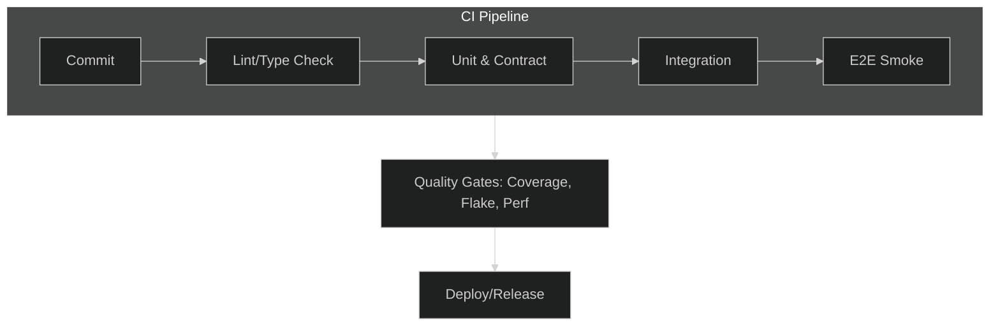
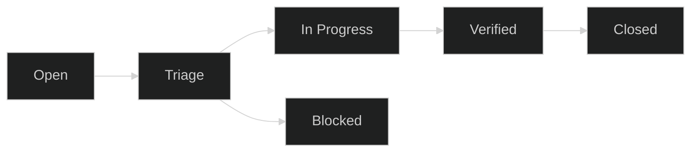

---
# Global deck settings
theme: default
title: "QA Process Modernized"
info: |
  Modern QA Process deck aligned to Ocean Professional: concise bullets, visuals, and practical speaker notes.
class: text-left
mdc: true
transition: slide-left
fonts:
  sans: Inter, ui-sans-serif, system-ui, -apple-system, Segoe UI, Roboto, Helvetica Neue, Arial
  mono: ui-monospace, SFMono-Regular, Menlo, Monaco, Consolas, "Liberation Mono", "Courier New", monospace
css: |
  @import "./style.css";
---

# QA Process, Purpose, and Principles

- Quality is a team responsibility
- Risk-based, data-driven, shift-left testing
- Transparency, automation, and continuous improvement

  
Ocean Professional

  <ul class="points-clean">
    <li>Primary accent: #2563EB (blue)</li>
    <li>Secondary accent: #F59E0B (amber)</li>
    <li>Modern layout with subtle gradients and soft shadows</li>
  </ul>

notes: |
  - Emphasize: quality is owned by the entire team (not just QA).
  - Shift-left: earlier feedback lowers cost of defects.
  - Keep the message crisp and value-focused.

---

# Agenda

- QA in the SDLC: Where QA adds value
- Test Strategy: Scope, risks, environments
- Test Pyramid and Types
- Automation in CI/CD
- Data & Environments
- Tooling & Reporting
- Defect Lifecycle & Triage
- Agile Collaboration
- Release Readiness
- Observability & Feedback
- Case Study & Metrics
- Roadmap and Appendix

notes: |
  - This is our roadmap; we’ll move briskly and focus on outcomes.
  - Each section has a visual or placeholder to aid discussion.

---

# QA in the SDLC — Where QA Adds Value

- Inception & planning: quality criteria, test strategy
- Development: unit, component, and contract tests
- Integration & system: end-to-end flows, non-functionals
- Release & operations: smoke checks, SLO monitoring, feedback loops

  
TODO: QA-in-SDLC Horizontal Timeline Diagram

notes: |
  - QA pairs with devs in build; contributes to clear criteria upfront.
  - Partners with SRE post-release to close the loop.

---

# Test Strategy — Scope, Risks, and Environments

- Scope: features, integrations, data, constraints
- Risk areas: complexity, dependencies, data sensitivity
- Environments: parity, data strategy, observability by default

  
Checklist

  <ul class="points-clean">
    <li>Define risk-based scope per feature</li>
    <li>Document environment parity expectations</li>
    <li>Plan observability signals for tests</li>
  </ul>

notes: |
  - Scope is driven by risk/impact, not just feature lists.
  - Environments must provide reliable, observable signals.

---

# Test Pyramid — Efficient Coverage

- Base: unit and contract tests (fast, reliable)
- Middle: service/integration tests (behavior coverage)
- Top: E2E sanity and critical paths only

  
TODO: Test Pyramid Diagram with ratios

notes: |
  - Keep most tests at the base for speed and stability.
  - E2E is high-value but should be minimal and reliable.

---

# Test Types — Functional and Non-Functional

- Functional: unit, API, UI, exploratory
- Non-functional: performance, security, accessibility, resilience
- Data quality: migrations, lineage, integrity

  

    
Functional

    <ul class="points-clean">
      <li>Unit & API</li>
      <li>UI sanity</li>
      <li>Exploratory charters</li>
    </ul>
  

  

    
Non-Functional

    <ul class="points-clean">
      <li>Performance</li>
      <li>Security</li>
      <li>Accessibility</li>
    </ul>
  

  

    
Data Quality

    <ul class="points-clean">
      <li>Migrations</li>
      <li>Lineage</li>
      <li>Integrity checks</li>
    </ul>
  

notes: |
  - Include non-functionals early (shift-left where feasible).
  - Accessibility and resilience are part of quality, not add-ons.

---

# Automation Strategy — CI/CD Integration

- Quality gates in CI (coverage, flake, perf budgets)
- Test selection (impacted tests, smoke suites)
- Parallelization, caching, and flake management

notes: |
  - Gates must be pragmatic and actionable.
  - Use impacted test selection to speed feedback loops.

---

# Test Data & Environments

- Synthetic vs sanitized production data
- Idempotent, deterministic patterns
- Environment parity and provisioning policy

  
TODO: Data Flow Sketch (generation, masking, seeding)

notes: |
  - Determinism reduces flakiness; document data contracts.
  - Provisioning policy defines how/when environments are created/reset.

---

# Tooling & Reporting

- CI and runner orchestration; artifact storage
- Standardized test reports and code coverage
- Defect and risk reporting; dashboards and alerting

  

    
Execution

    <ul class="points-clean">
      <li>Runners & caches</li>
      <li>Artifacts & logs</li>
    </ul>
  

  

    
Reporting

    <ul class="points-clean">
      <li>Standard formats</li>
      <li>Coverage utility</li>
    </ul>
  

  

    
Dashboards

    <ul class="points-clean">
      <li>Defect trends</li>
      <li>Risk signals</li>
    </ul>
  

notes: |
  - If a metric doesn’t drive decisions, it’s noise.
  - Centralize artifacts and make results easy to consume.

---

# Defect Lifecycle and Triage

- Defect states and SLAs
- Severity vs priority; reproduction and minimization
- RCA and remediation actions

notes: |
  - Clear states enable predictable triage and timely resolution.
  - Invest in RCA to prevent recurrence, not just fix symptoms.

---

# QA in Agile — Ceremonies & Collaboration

- Story readiness: acceptance criteria, testability
- Definition of Done (DoD) with quality gates
- Pairing with dev/UX and “three amigos” collaboration

  
TODO: Collaboration Diagram (Dev/QA/PM Three Amigos)

notes: |
  - Ensure stories are testable before sprint commitment.
  - Use test charters to complement ACs for exploratory depth.

---

# Release Readiness — Go/No-Go Criteria

- Checklist: smoke, critical path, non-functionals
- Rollback readiness and release notes quality
- Feature flags and progressive delivery

  
Go/No-Go Checklist

  <ul class="points-clean">
    <li>Critical paths green</li>
    <li>Rollback tested</li>
    <li>Flags & canary plan</li>
  </ul>

notes: |
  - Reduce risk using feature flags and canaries.
  - Make rollbacks easy, tested, and documented.

---

# Observability & Feedback Loops

- SLOs, error budgets, user telemetry
- Production test hooks and canary validation
- Incident review and continuous improvement

  
TODO: Feedback Loop Diagram (Prod → Tests → Strategy)

notes: |
  - Use production signals to inform test strategy.
  - Close the loop with post-incident learnings.

---

# Case Study (Condensed)

- Context: product area, risks, constraints
- Approach: test focus, automation scope, data strategy
- Outcomes: lead time, defect escape rate, MTTR, customer impact

  
Example Outcomes

  

    

      
-35%

      
Lead Time

    

    

      
-50%

      
Escaped Defects

    

    

      
-30%

      
MTTR

    

  

notes: |
  - Keep case study brief; emphasize outcomes and what changed.

---

# Metrics that Matter

- Lead time, change failure rate, defect escape rate
- Flake rate, test duration, coverage utility
- Actionable dashboards and quality signals

  
TODO: Metrics Dashboard Screenshot/Sketch

notes: |
  - Favor a small set of leading and lagging indicators tied to delivery and reliability.
  - Coverage utility > raw percentage.

---

# Roadmap for Quality Maturity

- Short-term: stabilize flake, right-size suites
- Mid-term: shift-left non-functionals, contract test coverage
- Long-term: experiment pipelines, AI-assisted testing

notes: |
  - Prioritize stability and effectiveness before expanding scope.
  - Use milestones to communicate maturity progression.

---

# Summary

- Quality is shared, risk-based, and automated
- Focus on reliable, fast tests and actionable metrics
- Close the loop with observability and continuous improvement

  

    
Next Steps

    <ul class="points-clean">
      <li>Adopt pragmatic CI gates</li>
      <li>Harden data determinism</li>
      <li>Define metrics and dashboards</li>
    </ul>
  

  

    
Resources

    <ul class="points-clean">
      <li>Test strategy template</li>
      <li>Release readiness checklist</li>
      <li>Triage/RCA guide</li>
    </ul>
  

notes: |
  - Reiterate the three pillars: shared ownership, efficiency, feedback loops.

---

# Appendix

- Glossary: key terms and acronyms
- Templates: test strategy, checklists, triage guide

  

    
Glossary

    <ul class="points-clean">
      <li>SLO: Service Level Objective</li>
      <li>MTTR: Mean Time to Recovery</li>
      <li>DoD: Definition of Done</li>
    </ul>
  

  

    
Templates

    <ul class="points-clean">
      <li>Test Strategy</li>
      <li>Release Checklist</li>
      <li>Triage & RCA</li>
    </ul>
  

notes: |
  - Keep deep definitions and references here for follow-up.

---

layout: center
class: text-center
---

# Thank You

Questions?

Press S for presenter mode • Press E to open editor • Use arrow keys to navigate

